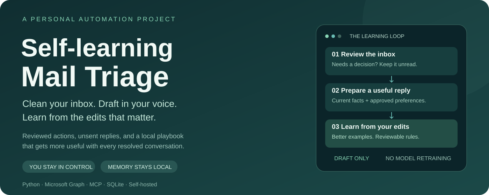
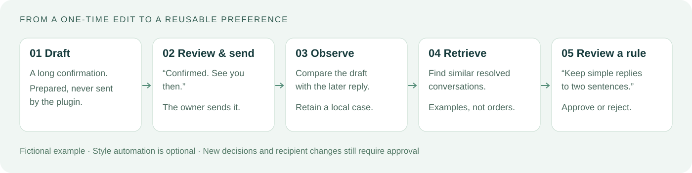
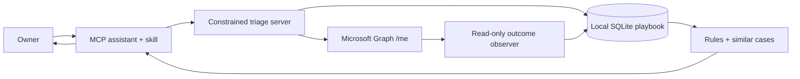

<p align="center">
  
</p>

<p align="center">
  <a href="https://github.com/i-xoxol/self-learning-mail-triage/actions/workflows/test.yml"></a>
  
  
  <a href="LICENSE"></a>
</p>

<p align="center"><strong>An email assistant that gets more useful as you review its work.</strong><br>
Outlook triage, meaningful reply drafts, and a local preference playbook — with you in control.</p>

<p align="center"><a href="#try-the-learning-loop">Try the demo</a> · <a href="docs/quickstart.md">Connect your inbox</a> · <a href="docs/learning.md">How learning works</a> · <a href="docs/privacy.md">Data & privacy</a> · <a href="docs/tools.md">Tool reference</a></p>

## Why I built this

An inbox contains several different kinds of work: messages that need a decision, routine updates, conversations that deserve a useful reply, and repetitive questions. I wanted an assistant that could recognize those differences and learn how I actually respond.

This project makes that workflow reusable. An MCP-compatible assistant supplies the reasoning and drafting; a constrained Python server supplies mailbox access, a reviewable action plan, and persistent local memory. The plugin improves through examples and explicit preferences rather than silently expanding its authority.

## What it does

| Capability | How it helps |
| --- | --- |
| Reviewed inbox triage | Keep action-worthy mail unread; mark routine mail read; archive only when authorized. |
| Meaningful reply drafts | Combine current message facts, your writing guidance, approved rules, and similar resolved cases. |
| Draft-versus-sent observation | Compare a prepared draft with your later sent reply to identify edits worth learning from. |
| Local case retrieval | Retrieve bounded, redacted examples from the same mailbox using deterministic ranking. |
| Durable preference playbook | Inspect, approve, reject, and audit proposed improvements. Start with no personal rules. |
| Optional style automation | Opt in to activating low-risk style proposals supported by at least three matched outcomes. |
| Verified CC contacts | Added CC addresses must come from a registry you explicitly verify. |
| Optional history import | Bootstrap case memory from a bounded period of existing conversations after explicit authorization. |

**“Self-learning” means retrieval and preference learning.** This repository does not train model weights. The observer records outcomes; the assistant interprets patterns and proposes rules. Operational decisions, recipients, and routing still require review. Automatic style learning is off by default, and the host must assess whether a proposed rule really concerns style.

## Try the learning loop

No email account, Microsoft app registration, or model API key is needed for this fictional demo.

```bash
git clone https://github.com/i-xoxol/self-learning-mail-triage.git
cd self-learning-mail-triage
python -m venv .venv
source .venv/bin/activate             # Windows PowerShell: .venv\Scripts\Activate.ps1
python -m pip install -r requirements.txt
python scripts/demo.py
```

The demo creates three fictional draft outcomes in a temporary database, proposes a preference for shorter confirmations, simulates owner approval, and retrieves a redacted example. The database is removed when it exits.

```json
{
  "fictional_demo": true,
  "email_account_connected": false,
  "matched_outcomes": 3,
  "proposal_before_demo_review": "pending",
  "active_rule": "Use one or two sentences for a simple confirmation.",
  "retrieved_example": "Could you confirm our meeting? Contact <EMAIL> for context."
}
```

Use `python scripts/demo.py --auto-style` to explore opt-in style activation with the same fictional evidence.

## From edits to better replies



Suppose the assistant writes a long meeting confirmation. You shorten it before sending. One edit stays an example. Repeated similar edits can support a proposal such as “keep simple confirmations to two sentences.” On a later message, the assistant retrieves relevant examples and applies your approved preference alongside the current facts.

A past reply cannot establish today's availability or authorize a new recipient. Evidence supports a suggestion; approval establishes a durable rule.

## Connect your own inbox

1. Register your own Microsoft Entra public-client application with delegated `Mail.ReadWrite` permission. Tenant policy may require administrator consent.
2. Set `OUTLOOK_GRAPH_CLIENT_ID`, then run `python scripts/authenticate.py` to sign in through Microsoft's device-code flow.
3. Generate the machine-local MCP configuration with `python scripts/configure_mcp.py`.
4. Connect your MCP client and load the packaged `mail-triage` skill. In a supported Codex desktop client, register this local marketplace and install the plugin after configuration.
5. Ask it to review unread mail and present a complete plan before applying changes.

Follow the [quickstart](docs/quickstart.md) for exact PowerShell and Linux commands, plugin installation, private storage, and your first reviewed run. For a remote client, use the [HTTP deployment guide](docs/deployment.md) with your own HTTPS endpoint and OAuth pairing.

## Architecture



The assistant decides what to suggest. The server checks snapshots, mailbox identity, action types, confirmation flags, and verified contact IDs. Microsoft authentication and optional remote MCP authentication are separate. There is no send or delete tool.

## Control and privacy

- A triage plan covers every snapshot message exactly once; the server rechecks message identity before changes.
- Drafts stay unsent. Reply creation can change the original message's read state in Outlook; check it again when preserving unread status matters.
- Inbox previews and selected Sent Items are exposed to the connected assistant. Draft observation also retains proposed and sent text locally for comparison.
- Case excerpts redact common addresses, URLs, phone numbers, tokens, and identifiers. Redaction is best-effort; names and sensitive meaning can remain.
- Tokens, databases, profiles, learned rules, real contacts, and mailbox history are runtime data outside the repository. SQLite and MSAL caches are not encrypted by this application.
- One deployment serves one owner. Case search is mailbox-scoped; shared playbooks, contacts, and observers are not designed for multiple tenants.

See [privacy and retention](docs/privacy.md) for exactly what is stored and [security](SECURITY.md) for the trust boundaries.

## Documentation

| Guide | What you will find |
| --- | --- |
| [Quickstart](docs/quickstart.md) | Demo, authentication, local MCP, plugin installation, first review |
| [Authentication](docs/authentication.md) | Your own app registration, consent, device login, silent refresh |
| [Configuration](docs/configuration.md) | Environment settings, private voice profile, signature, contacts |
| [Learning](docs/learning.md) | Outcomes, case retrieval, proposal gates, historical import |
| [Architecture](docs/architecture.md) | Components, storage, request flow, enforced and host-level checks |
| [Tool reference](docs/tools.md) | MCP tools grouped by purpose and side effects |
| [Deployment](docs/deployment.md) | Stdio, HTTP OAuth pairing, reverse proxy, optional observer timer |
| [Privacy](docs/privacy.md) | Data inventory, retention, exports, backups, removal |
| [Troubleshooting](docs/troubleshooting.md) | Authentication, missing servers, stale snapshots, missed outcomes |

## Development

```bash
python -m unittest discover -s scripts -p "test_*.py" -v
python scripts/check_mcp.py
python scripts/audit_public_source.py
```

The offline suite covers review gates, read-before-archive behavior, case redaction and mailbox scope, idempotent imports, proposal review, OAuth rotation and client binding, generic configuration, and the fictional demo. The MCP check starts a real stdio server and inspects its tools without authenticating to email. CI runs on Linux with Python 3.11–3.14 and on Windows with Python 3.12. Live Graph integration requires your own account and is outside CI.

```text
scripts/             Server, Graph client, memory, observer, CLI helpers, tests
skills/mail-triage/  Assistant workflow and authorization boundaries
.codex-plugin/       Codex-compatible plugin manifest
.agents/plugins/     Local marketplace catalog
examples/            Fictional private-profile template
deploy/systemd/      Optional Linux user services
docs/                Setup, operation, learning, privacy, and troubleshooting
assets/              Repository-native SVG visuals
```

This is a self-hosted reference implementation. It currently supports Outlook through Microsoft Graph, English-oriented case metadata, and conversation-based outcome matching. There is no Gmail adapter, background model trainer, full attachment reader, or multi-user service. The included timer observes outcomes; it does not run an assistant or apply triage on its own.

Contributions are welcome; see [CONTRIBUTING.md](CONTRIBUTING.md). Licensed under [MIT](LICENSE).
